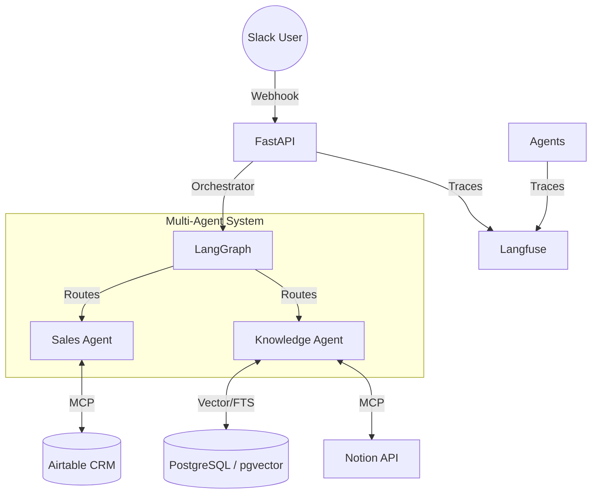

# Architecture Overview

The system is built on a modular **Hub-and-Spoke** architecture using **LangGraph** for multi-agent orchestration. This design ensures separation of concerns, where the orchestrator makes routing decisions, and specialized agents perform specific tasks (CRM management, knowledge retrieval).

## 1. System Flow
1. **Entry Point (Webhook/Chat):** User sends a message via Slack.
2. **Orchestrator:**
   - Receives raw query via FastAPI.
   - Uses `classify_node` (Groq LLM) to classify intent (Sales vs Knowledge).
   - Routes to the appropriate agent.
3. **Execution Layer:**
   - **Sales Agent:** Queries Airtable via MCP-based tool, performs lead scoring, and updates status.
   - **Knowledge Agent:** Performs Hybrid RAG (Vector Search + Full-Text) on PostgreSQL/ChromaDB + Notion via MCP-tool.
4. **Monitoring:** All steps are logged to **Langfuse** for observability, latency tracking, and cost management.
5. **Safety Layer:** Every outgoing message passes through `sanitize_text` to mask PII (Emails/Phones).

## 2. Spec-First Development
The system follows a **spec-first development approach**:
- **State Definition:** System state (`OrchestratorState`) was strictly defined using `TypedDict` and `Annotated` types before implementation to ensure type safety across agents.
- **Interface-first Tools:** MCP-based tool interfaces were designed to be agnostic of the specific LLM provider, allowing seamless switching between local models (Llama-3) and cloud APIs (Groq).
- **Data Mapping:** Data schemas for Airtable and Notion were mapped to system entities early in the development lifecycle to ensure clean ETL processes.

## 3. Diagram

## 3. Technology Highlights

| Technology | Description |
|------------|-------------|
| **LangGraph** | Manages stateful agent workflows |
| **pgvector** | Used for high-performance semantic similarity search in PostgreSQL |
| **Hybrid RAG** | Combines vector similarity (for meaning) with `ts_rank` (for precision) |
| **Resilience** | Automatic retries for external APIs via `tenacity` |
| **Security** | Middleware layer for PII filtering ensures compliance |
